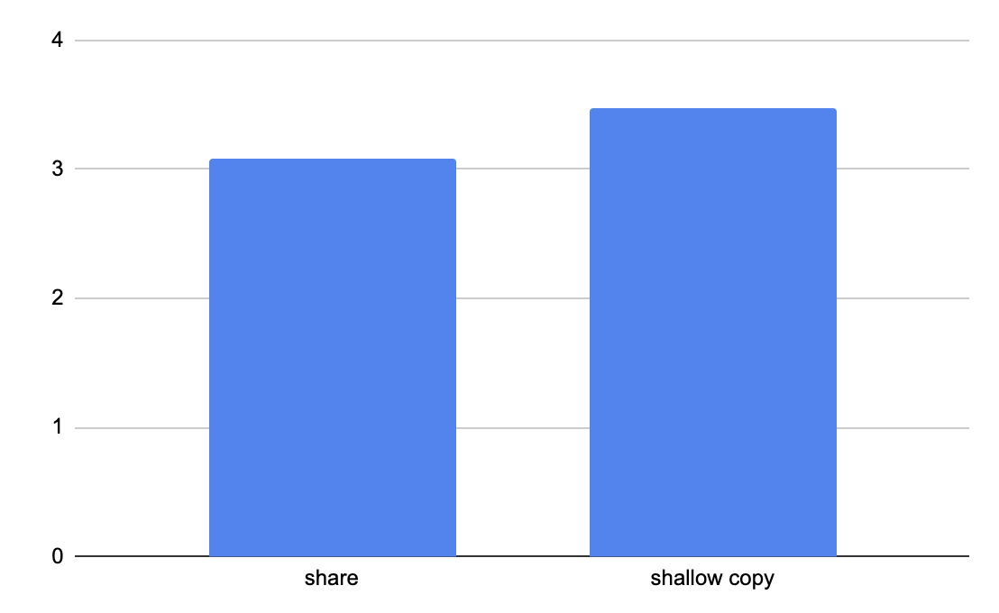
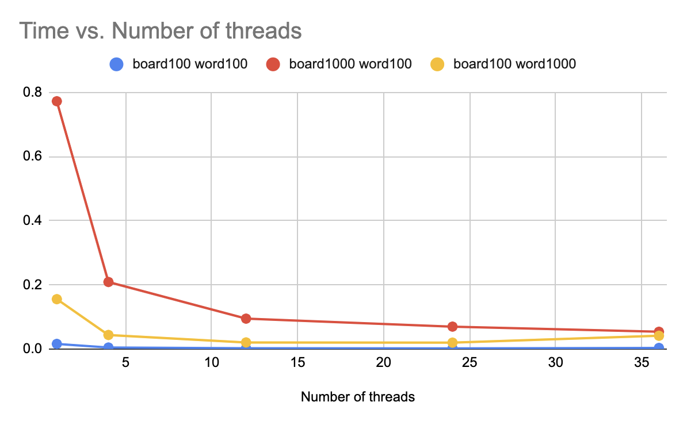
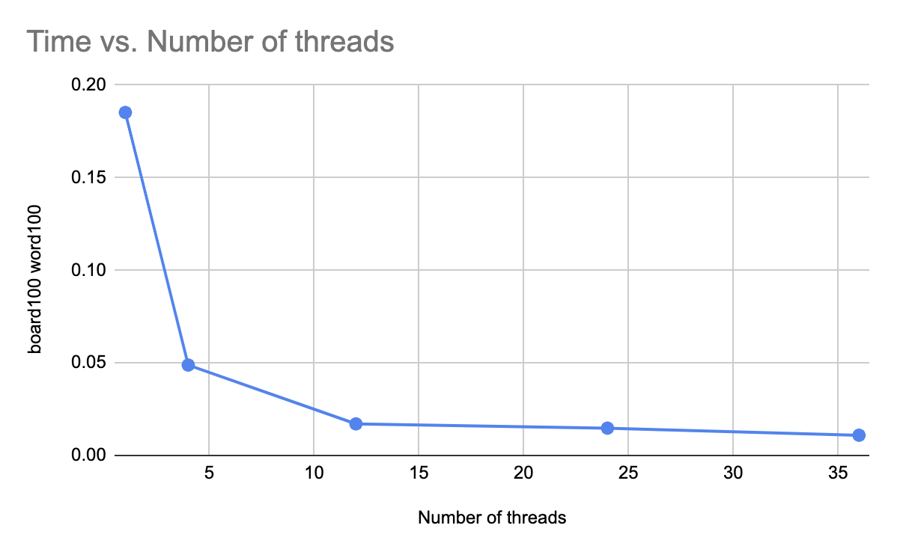

# Parallel Computing of Word Search

Zhongqian Duan

duanzq@umich.edu

## Project Description

The idea of the project comes from word search game. It is a puzzle game in which the player must search for a given set of words in a grid of letters. The grid  consists of a rectangular grid of letters, with the words hidden in various directions within the grid. The player must search for the words by looking for them in the grid, either horizontally, vertically, or diagonally. When the player finds a word, they typically mark it off on a list to keep track of their progress. The game ends when the player has found all of the words on the list. 


\cite{https://thewordsearch.com/}

Define **adjacent cells** are horizontally, vertically or diagonally neighboring. Given an `m x n` `board` of characters and a list of strings `words`, return all words on the board. Each word must be constructed from letters of sequentially adjacent cells.

## Data Description

I used the random function in python to generate the board with length `50, 100, 500, 1000`,  and the generated files are named as `board_50.txt, board_100.txt, board_500.txt, board_1000.txt` respectively.

I also randomly picked words from a [website](http://www.instructables.com/files/orig/FLU/YE8L/H82UHPR8/FLUYE8LH82UHPR8.txt) that contains all common English words. I generated word lists with length `50, 100, 500, 1000`, and the generated files are named as `wordList_50.txt, wordList_100.txt, wordList_500.txt, wordList_1000.txt` respectively. Note that I used the following code to ensure that the minimum length of a word is at least 5 so that they are not too trivial to be found on a board.

`WORDS = list(filter(lambda x: len(x) >= 5, WORDS))`

## Parallel Approach with OpenMP

### Parallel Breadth First Search (BFS)

For each word, consider the current state as follows:

```c++
struct State{
    int row; // current row on board
    int col; // current col on board
    int idx; // current index of the word
    bool *visited; // size: m * n, to record which cells have been visited on board
};
```

`visited` is to ensure that we do not come back to some cells that have been used before. The word is found if `idx` reach the end of the word. That is `idx == word.length() - 1`

So basically, we will have a first-in-first-out `queue` that contains `State` data structure. While `queue` is not empty, pop out the front element, check the next `State` in eight directions (horizontal, vertical or diagonal), and push back if all conditions are satisfied. The conditions are defined as

```
1. For next State, row and col should be in boundry
2. board[next.row][next.col] has not been visited
3. board[next.row][next.col] == word[idx + 1]
```

We test the parallel version of BFS for `board_100.txt` and `wordList_100.txt` with different number of threads. The figure is shown below. We found that the time do not decrease as the number of thread increases. The reason is that `queue` is shared among all threads. So when we want to pop or push into `queue`, lock is needed. And since there is no huge amount of calculation in the section that do not require a lock, the parallel of bfs is almost serial.


But we found a place of code modification that can speed up the program. When create the next `State`, instead of shallow copy from the current `State` on the parameter `visited`, we can directly share one. 



### Parallel Backtracking

We first iterate through all words in the `wordlist`. And for each word, use backtracking algorithm. So basically, we do backtracking parallelly for each word.

Instead of recording which cell in the board has been visited using `bool *visited`, we directly modify the cell to `#`. Since all the inital characters on board are from `a - z` , the character `#` can be used to distinguish whether the cell has been used. The pseudocode is shown below:

```c++
if idx is equal to word length:
	return true
if row or col out of boundry:
	return false
	
Define c = board[row][col]
if c is equal to '#' or c is not equal to word[idx]:
	return false
	
board[row][col] = '#'
search through all eight directions (horizontal, vertical or diagonal)
		call dfs with next_row, next_col, and idx + 1
board[row][col] = c

```

The time results with different number of threads, board size and wordlist length are shown in the following table.

| Number of threads | board100 word100 | board1000 word100 | board100 word1000 |
| ----------------- | ---------------- | ----------------- | ----------------- |
| 1                 | 0.0160846        | 0.77231           | 0.155446          |
| 4                 | 0.00476635       | 0.208987          | 0.0438657         |
| 12                | 0.00255218       | 0.0947516         | 0.0205949         |
| 24                | 0.00206554       | 0.0699081         | 0.0200177         |
| 36                | 0.00267512       | 0.0538697         | 0.0414328         |



### Building prefix tree (Trie)

The structure of TrieNode is defined below. So instead of iterating through word one by one, we can search all words at the same time through going down the tree structure.

```c++
struct TrieNode {
    TrieNode *children[26];
    string word;
    TrieNode() : word("") {
        for (int i = 0; i < 26; i++) {
            children[i] = nullptr;
        }
    }
};
```

Here is an example of a TrieTree converted from `wordList: and, ant, dad,  do`. The image comes from the [wesite](https://www.geeksforgeeks.org/trie-insert-and-search/). The string parameter in TreNode `word` will be empty except that the node reaches the end of one word, meaning `word` is in the list.


### Parallel building Trie

We try to build Trie in parallel. In structure of TrieNode, we add a new parameter `omp lock`. And set the lock in the critical section. The time test result is as follows. Based on the result, we decided to just build Trie serially.

| Number of threads | Serial  | Parallel    |
| ----------------- | ------- | ----------- |
| 4                 | 0.00014 | 9.34E-05    |
| 12                | 0.00014 | 0.000189623 |
| 24                | 0.00014 | 0.000503454 |
| 36                | 0.00014 | 0.0129905   |

### Parallel Backtracking with Trie

We first convert `wordlist` into a Tree that is built by TrieNode. And we change where we do things in parallel: now we search beginning at each cell on the board parallelly instead of searching each word parallelly.

Since we are doing `backtracking` in parallel and `board` is shared among all threads. So the initial thought is to add a lock when modifiying the board. For example:

```c++
omp_set_lock(&lock);
board[i][j] = '#';
omp_unset_lock(&lock);
```

The time test results are as follows: the more threads, the slower the paragram.


The reason for slowing down is caused by sharing one board among all threads and acquiring the same lock. So I came up with the idea to copy a new board for each thread. The time test results are as follows.




### Serial BFS + Parallel Backtracking with Trie

Since we are using Trie and the data processed by bfs will be further used for backtracking, we redefine the current `State` as follows:

```c++
struct State{
    int row; // current row on board
    int col; // current col on board
   	TrieNode *node; // current node on Trie
    char* board; // size: m * n, to record current board
};
```

For the BFS part, we first push all points on the board into the `queue`, where `node = root` and `board` is initialized as the primary board. We also use `#` on board to mark that cell has been visited before. Define a new parameter `num_iteration`. In a for loop with `num_iteration` times, get the current `size` of `queue` and call a for loop with `size` times to pop out the queue and search in eight directions.

We set number of thread as 36 and test on `board_100.txt` and `wordList_100.txt`. The time test result is shown below:

| num_iteration | BFS      | Backtraking | Total    |
| ------------- | -------- | ----------- | -------- |
| 2             | 0.832511 | 0.0858989   | 0.91862  |
| 5             | 0.840032 | 0.02509     | 0.865122 |
| 10            | 0.83833  | 0.00196344  | 0.840498 |

We found the majority of the time is spent on BFS, so we tried to parallelize it in the next section.

### Parallel BFS + Parallel Backtracking with Trie

Basically, we need to set the lock when modifying the `queue` that stores  `State`. In the initial step of BFS, we need to copy the board from the original one. We found that if we use `memcpy` with `char*` instead copying 2d vector can speed up Parallel BFS. The time test result is:


 And based on what we discussed before, when create the next `State`, instead of shallow copy from the current `State` on the parameter `board`, we can directly share one. 

Again, we set number of thread as 36 and test on `board_100.txt` and `wordList_100.txt`. The time test result is shown below:

| num_iteration | BFS      | Backtraking | Total      |
| ------------- | -------- | ----------- | ---------- |
| 2             | 0.375014 | 0.085846    | 0.461149   |
| 5             | 0.619349 | 0.00141555  | 0.62076455 |
| 10            | 0.501574 | 1.27E-05    | 0.501877   |

We found that BFS part does get speed up compared to the serial version.

Again, we set num_iteration as 5 and test with different number of threads, board size and wordlist length are shown in the following image.


## Validation Results

For `board_50.txt` and `wordList_50.txt`, the results are `sleep, wiles`

For `board_100.txt` and `wordList_50.txt`, the results are `blets, nemeses, poach, rheum, sleep, wiles`

For `board_100.txt` and `wordList_100.txt`, the results are `cowers, discuss, dorado, eager, myths, tenty, yapped`

I also tested other combinations of board and wordList. But when the size of the board or wordList gets larger, the results are also long. So I just listed the results for some simple cases.

## Future Work

In this report, I mainly tried parallelism on OpenMP due to limited time. The future work is that we can try to use Cuda. I think doing BFS at first and then backtracking on Cuda may speed up the program more.